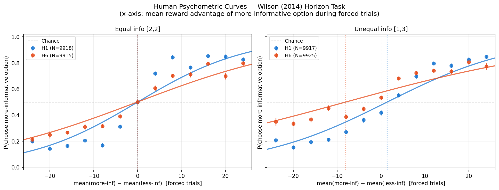

# Wilson (2014) Horizon Task — LLM Behavioral Analysis

Final project for CPSY 1950. Tests whether large language models reproduce the human
directed- and random-exploration signatures from the classic explore/exploit study:

> Wilson, R. C., Geana, A., White, J. M., Ludvig, E. A., & Cohen, J. D. (2014).
> Humans use directed and random exploration to solve the explore–exploit dilemma.
> *Journal of Experimental Psychology: General*, 143(6), 2074–2081.
>
> [Copy of CPSY1950 Final Project Draft Poster.pdf](https://github.com/user-attachments/files/29926629/Copy.of.CPSY1950.Final.Project.Draft.Poster.pdf)

## What this does

The horizon task is a two-armed bandit: each game has 4 forced-choice trials (the model is
told which arm to play, giving it information) followed by either 1 or 6 free-choice trials
(the "horizon"). By varying how evenly information is split across the two arms (`[2,2]` vs
`[1,3]`) and the horizon length, the task isolates two exploration strategies humans use:

- **Directed exploration** — deliberately picking the less-sampled (more uncertain) option,
  which increases with a longer horizon.
- **Random exploration** — added choice noise, which also increases with a longer horizon.

This project takes human transcripts from the [`marcelbinz/Psych-101`](https://huggingface.co/datasets/marcelbinz/Psych-101)
dataset (`wilson2014humans/exp1.csv`), replays the same games to LLMs (Llama-3.3-70B-Instruct,
GPT-5.2) via an OpenAI-compatible API, and compares the resulting choice probabilities and
per-choice negative log-likelihoods against the human data.

## Results (preliminary)



Contrary to the "LLMs might just be pattern-matching to descriptions of this well-known task"
concern, neither model reproduces the human directed-exploration signature — both move in the
*opposite* direction from humans as the horizon lengthens. GPT-5.2 in particular avoids the
more-informative option far more than humans (or chance) do. See `Section 7.2` of the notebook
for the full breakdown and numbers; the discussion also covers confounds (training-data
contamination, autoregressive/perfect-memory artifacts) and current limitations (small per-cell
sample sizes, unstable psychometric-curve fits).

## Project structure

| File | Purpose |
|---|---|
| [`wilson2014_horizon_task.ipynb`](wilson2014_horizon_task.ipynb) | Main notebook: data loading, transcript parsing, LLM querying, analysis, and discussion |
| [`helpers.py`](helpers.py) | Small utility for extracting ranked token log-probabilities from API responses |
| [`wilson2014_llm_results.csv`](wilson2014_llm_results.csv) | Saved per-game results (human + model choices, info condition, NLL) from a completed run |
| [`human_psychometric_curves.png`](human_psychometric_curves.png) | Human baseline psychometric curves |

## Setup

```bash
pip install -r requirements.txt
```

The notebook expects an OpenAI-compatible API key in a `.env` file:

```
OPENAI_API_KEY=your-key-here
```

By default it points at Brown's internal LiteLLM gateway (`https://litellm.ccv.brown.edu`); to
run against the public OpenAI API instead, change `BASE_URL` in Section 1 and update
`MODEL_CANDIDATES` to model names available on your endpoint.

Then open `wilson2014_horizon_task.ipynb` and run top to bottom. Section 2 downloads and caches
the `Psych-101` dataset from Hugging Face on first run.
